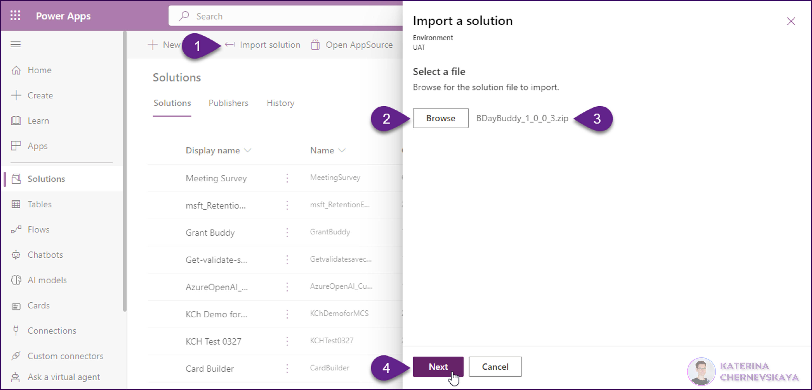
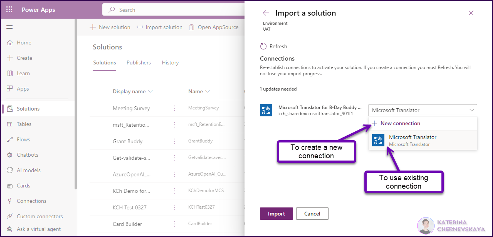
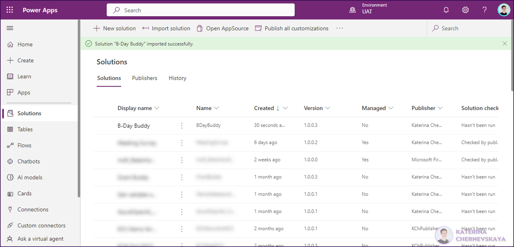
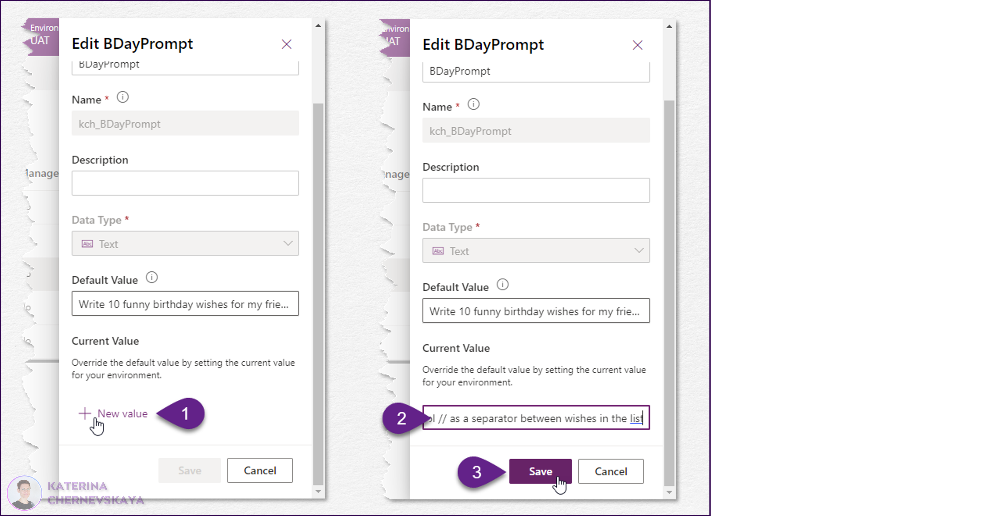
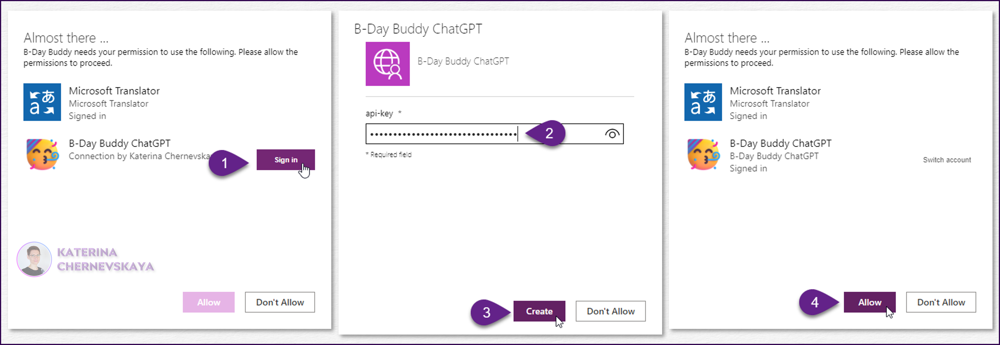
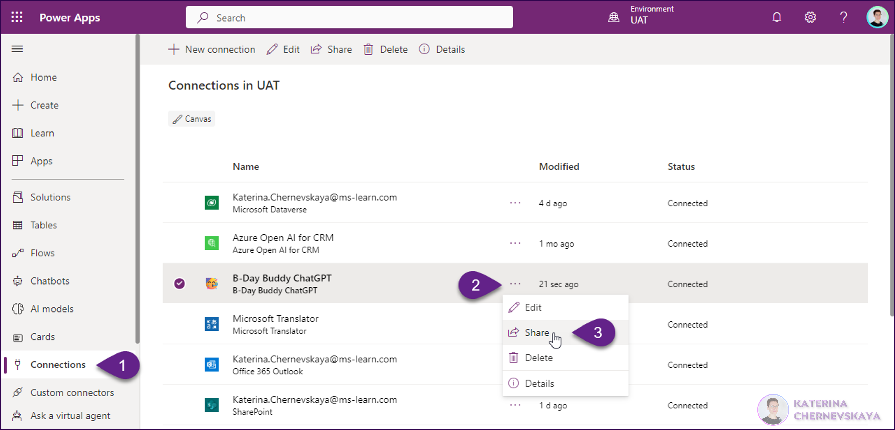

# B-Day Buddy

## Summary

This sample, utilizing Azure Open AI, facilitates the creation of humorous birthday greetings, which can be translated into various random languages and audibly played back. Its modern one-button interface ensures user-friendly operation on a desktop or mobile device.

*For an audio-inclusive experience, please view the video on YouTube: [B-Day Buddy](https://youtu.be/Qvaa4iAy6LQ)*

## Applies to

* [Microsoft Power Apps](https://docs.microsoft.com/powerapps/)
* [Azure OpenAI](https://learn.microsoft.com/en-us/azure/cognitive-services/openai/)

## Compatibility

## Authors

Solution|Author(s)
--------|---------
B-Day-Buddy | [Katerina Chernevskaya](https://github.com/Katerina-Chernevskaya) ([LinkedIn](https://www.linkedin.com/in/katerinachernevskaya/)), Awara IT Academy

## Version history

Version|Date|Comments
-------|----|--------
1.0|June 09, 2023|Initial release

## Features

This sample illustrates the following concepts:

* Custom Connector integration seamlessly integrates with ChatGPT, enabling the generation of funny birthday wishes.
* Environment Variable utilization involves storing the prompt string to support easy modification and updating without requiring changes to the app's underlying code.
* Data Validation and Cleaning in Power Apps ensure the app presents only clean and readable data to the users.
* Responsive Design enables the layout to adapt seamlessly to different devices.
* The app embraces a modern UX design, incorporating intuitive one-button navigation, visually appealing graphics, and interactive components.
* The app utilizes integration with Azure Application Insights to monitor the app's usage and performance.

## Prerequisites

* A Power Platform Environment with Dataverse

## Solution Components

The following solution components are used in this sample:

* Canvas App `B-Day Buddy`
* Custom Connector `B-Day Buddy ChatGPT`
* Environment Variable `BDayPrompt`
* Environment Variable `EnvironmentName`
* Connection Reference `Microsoft Translator for B-Day Buddy`

## Minimal Path to Awesome

* Download the `.zip` from the `solution` folder
* Go to [Power Apps Studio](https://make.powerapps.com/), open the dedicated environment where you would like to import the solution, go to `Solutions` and click `Import solution`
* Select the solution by clicking `Brows` button and press the `Next` button 

* Review all fields on the next screen and click `Next` button
* On the next screen configure connection to the Microsoft Translator. If you already have this connection in your environment - select it in the dropdown. If you don't have one or if you would like to create a new one - click on `New connection` and proceed with the new connection creation.

Once the connection is configured - click `Next` button

*After the solution will be imported successfully - you will see the notification and the solution will be available in the list.*

* Open the solution `B-Day Buddy` and update values for Environmental Variables `EnvironmentName` and `BDayPrompt`. To achieve this, click on the `BDayPrompt` variable name, then under `Current value`, click on `New value`. Input your desired value and finally click `Save`. Repeat these steps for the `EnvironmentName` variable. 

* Create a connection reference to the custom connector. For this - open the `B-Day Buddy` app in the **play** mode. In the pop-up window click `Sign in` near to the custom connector name (`B0Day Buddy ChatGPT`). Enter your API key, click `Create` and then cleck `Allow`.

* Share created connection reference with people who will use the B-Day Buddy app. To achieve this, navigate to `Connections` in the Power Apps Maker portal, click on three dots next to the connection's name, and click `Share`.

In the pop-up window select `Add everyone in my org` to share this connection reference to the whole organization, or enter selected users in the field. Then click `Save`.

Once all steps will be completed users will be able to use this app on PC, tablets or their mobile phones.

## Disclaimer

**THIS CODE IS PROVIDED *AS IS* WITHOUT WARRANTY OF ANY KIND, EITHER EXPRESS OR IMPLIED, INCLUDING ANY IMPLIED WARRANTIES OF FITNESS FOR A PARTICULAR PURPOSE, MERCHANTABILITY, OR NON-INFRINGEMENT.**

